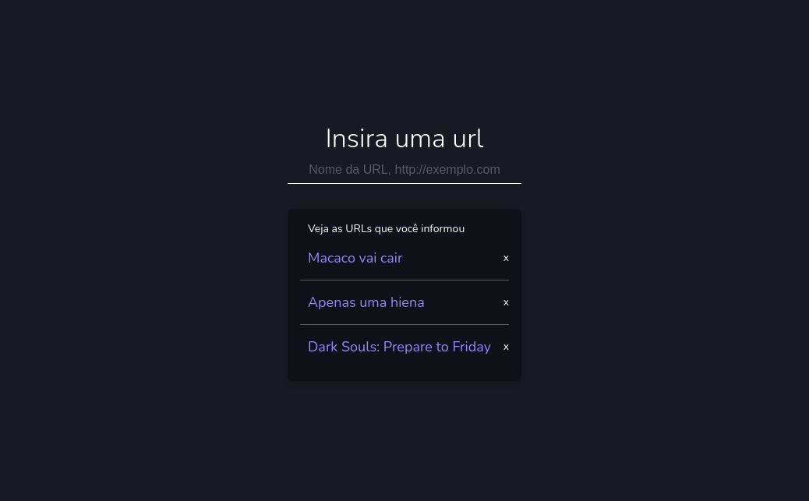
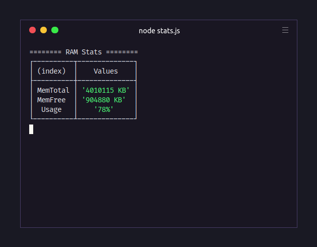

# Node.js: Iniciando da teoria à prática | Masterclass</h1>
Repositório dedicado à prática e resolução dos desafios da masterclass "Node.js: Iniciando da teoria à prática", do Mayk Brito, que mostra um pouco de teoria e bastante prática, desenvolvendo algumas aplicações com Node puro, para conhecer os módulos nativos como `os`, `fs`, `path`, `url`, `events`, `http` e comportamentos do Node no geral como, por exemplo, o **Event Loop**.

Você pode acessar a aula através desse link: <a href="https://www.youtube.com/watch?v=DiXbJL3iWVs">https://www.youtube.com/watch?v=DiXbJL3iWVs</a><br>

## Acessando as aplicações
Para acessar as aplicações desse repositório, é necessário ter o Node.js instalado em sua máquina. Você pode realizar o download na <a href="">página inicial</a> ou <a href="https://nodejs.org/en/download/package-manager/">via pacotes</a>. É possível verificar se ele está instalado em sua máquina, usando o seguinte comando:
```
node -v
```
Junto com o Node.js, você também conseguirá o gerenciador de pacotes <a href="https://www.npmjs.com">NPM</a>. Também é possível verificar sua presença, com o seguinte o comando:
```
npm -v
```
Tendo o Node.js e o NPM instalados, basta clonar o repositório (ou <a href="https://github.com/rafaeldiehl/masterclass-nodejs/archive/master.zip">baixar como zip</a>, se preferir ou não tiver o git instalado):
```
git clone https://github.com/rafaeldiehl/masterclass-nodejs.git
```
Acesse o diretório principal (note que se você baixou o repositório como zip, o nome do diretório será "masterclass-nodejs-master") e instale as dependências:
```
cd masterclass-nodejs/

npm install
```

## Gerenciador de URLs

<div align="center">
  
</div>

Para acessar o gerenciador de URLs, inicie-o com o NPM:
```
npm start
```

Você pode alterar as portas do servidor e da API, modificando os arquivos `http/server.js` e `http/api/index.js`:
```js
const http = require('http');
const fs = require('fs');
const path = require('path');

const port = 5000; // mude o número da porta

http.createServer((req, res) => {...
```
O gerenciador de URLs permite que o usuário cadastre URLs, inserindo os dados no input com a sintaxe `<nome da url>, http://...`, e apagá-las, clicando no `x` ao lado delas. Imediatamente são feitas as alterações no arquivo `http/api/urls.json`. Caso ocorra algum problema, ou caso queira excluir ou adicionar URLs rapidamente, você pode alterá-lo manualmente:
```json
{
  "urls": [
    {
      "name": "Nome da URL",
      "url": "https://teste.com"
    }
  ]
}
```

## Exibição dos dados da CPU

<div align="center">
  
</div>

Para exibir os dados da CPU, inicie o arquivo `stats.js`:
```
node stats.js
```
Os dados são atualizados a cada 1 segundo e armazenados no arquivo `log.txt`, através de uma função do `logger.js`. Além disso, há um função disponível que converte dados em bytes para outras unidades (ele pode ser usado em conjunto com o `os.freemem()` e o `os.totalmem()`): 
```js
function bytesToSizes(bytes) {
  const sizes = ['B', 'KB', 'MB', 'GB', 'TB'];
  for(let i = 0; i < sizes.length; i++) {
    let toSize = parseInt(bytes*(Math.pow(10, i * (-3))));
    console.log(`| ${toSize} ${sizes[i]}`)
  }
}
```

